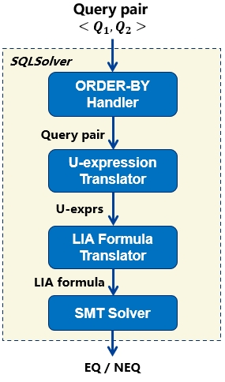

# SQLSolver
SQLSolver is an automated prover for the equivalence of two SQL queries.

## Codebase

This codebase includes the source code and the testing scripts.
```text
.
|-- common/            # Common utilities.
|-- lib/               # Required external library.
|-- runners/           # Click-to-run scripts for SQLSolver.
|-- sql/               # Data structures of SQL AST and query plan.
|-- stmt/              # Manager of queries from open-source applications.
|-- superopt/.../      # Core algorithm of SQLSolver.
    |-- constraint/    # Constraint enumeration.
    |-- fragment/      # Plan template enumeration.
    |-- liastar/       # Core algorithm of LIA*.
    |-- logic/         # SMT-based verifier.
    |-- optimizer/     # Rewriter.
    |-- uexpr/         # U-expression.
    |-- util/          # Tools
|-- testbed/           # Evaluation framework.
|-- wtune_data/        # Data input/output directory.
```

## Environment setup

### Requirements

- Ubuntu 20.04 (or below)
- Java 17
- Gradle 7.3.3
- z3 4.8.9 (SMT solver)
- antlr 4.8 (Generate tokenizer and parser for SQL AST)

z3 and antlr library have been put in lib/ off-the-shelf.
If you do not have Java or Gradle installed, you may refer to these instructions:

```shell
# installing Java 17
sudo add-apt-repository ppa:linuxuprising/java
sudo apt update
sudo apt-get install -y oracle-java17-installer oracle-java17-set-default

# installing Gradle 7.3.3
wget https://services.gradle.org/distributions/gradle-7.3.3-bin.zip -P /tmp
sudo unzip -d /opt/gradle /tmp/gradle-7.3.3-bin.zip
sudo touch /etc/profile.d/gradle.sh
sudo chmod a+wx /etc/profile.d/gradle.sh
sudo echo -e "export GRADLE_HOME=/opt/gradle/gradle-7.3.3 \nexport PATH=\${GRADLE_HOME}/bin:\${PATH}" >> /etc/profile.d/gradle.sh
source /etc/profile
```

### Compilation

```shell
gradle compileJava
```

## Architecture

SQLSolver accepts two SQL queries as its input and outputs the verification result, which is either `EQ` or `NEQ`.
As shown in the following architecture, SQLSolver checks the equivalence of two given SQL queries through the following steps:

<div align="center">



</div>

1. Address ORDER-BYs in the given SQL queries and output new SQL queries ([sortHandler](superopt/src/main/java/wtune/superopt/logic/OrderbySupport.java)) .
2. Translate each SQL query without ORDER-BYs to be an algebra called U-expression ([translateQueryToUExpr](superopt/src/main/java/wtune/superopt/uexpr/UExprSupport.java)).
3. Translate the two U-expressions into a LIA formula, which is a FOL formula about integers. ([uexpToLiastar](superopt/src/main/java/wtune/superopt/logic/SqlSolverSupport.java))
4. Solve the LIA formula via an SMT solver.

## Usage

### Prepare table schemas and queries

First, include table schemas along with integrity constraints in a file.
The file should be a SQL file comprising `CREATE TABLE` statements written in MySQL grammar.
The file path should be `wtune_data/schemas/APP_NAME.base.schema.sql`
where `APP_NAME` is passed to CLI later as a parameter.

Then, prepare queries to be verified in another file.
The file should contain `2*N` lines, and each line should contain exactly one query.
The queries at line `2*i-1` and line `2*i` constitute a pair, whose equivalence is to be verified.
So there are `N` pairs of queries in the file.

### Run in shell

```shell
python3 runners/run-sqlsolver.py [-time] [-app APP_NAME] [-input INPUT_FILE] [-rounds ROUNDS] [-target TARGET] [-skip SKIPPED_PAIR] [-out OUTPUT_FILE] [-tsv TIME_FILE] [-tsv_neq]
```

The script supports the following options:

* `-time`: Output the verification latency (milliseconds) for each pair of equivalent queries that can be proved by the prover. Each test case will be proved 5 times by default (which can be configured via the option `-rounds` described below). The script calculates the average verification latency for each test case.
* `-app APP_NAME`: Specify the app name, which indicates the schema name `wtune_data/schemas/APP_NAME.base.schema.sql`.
* `-input INPUT_FILE`: Specify the input file containing SQL queries.

Since SQLSolver may spend much time in proving some cases, the script supports the following options to skip some cases and configure repetition count:

* `-skip SKIPPED_PAIR`: Skip the pairs specified by `SKIPPED_PAIR`. For example, `-skip 220` skips the 220th pair.
* `-target TARGET`: Invoke the prover to verify only the pair with the specified identifier `TARGET`. For example, `-target 220` will ask the prover to verify only the 220th case.
* `-rounds ROUNDS`: Each successfully verified pair is proved `ROUNDS` times if `-time` is set. The average verification latency is regarded as the running time of that pair.
  The default value of `ROUND` is 5.

To persist the output into a file, the script provides the following options:

* `-out OUTPUT_FILE`: Save results in a text file, namely `OUTPUT_FILE`.
* `-tsv`: Record verification time (milliseconds) in a file, where the n-th line contains the verification time of the n-th test case.
  The verification time of NEQ cases is not recorded by default and corresponds to empty lines in the file.
  The default file name is `tmp_result.tsv`.
  This option is ignored if `-time` is not set.
* `-tsv_neq`: Also record the verification time of NEQ cases in the file specified by `-tsv`.
  This option is ignored if either `-time` or `-tsv` is not set.

## Evaluation scripts

We have prepared some scripts to evaluate SQLSolver.

### Evaluate SQLSolver on equivalent query pairs derived from Calcite and Spark SQL

The following command runs a script that evaluates SQLSolver on a set of equivalent query pairs.

```shell
# Run SQLSolver against tests
python3 runners/run-tests-sqlsolver.py [-time] [-tests TEST_SET] [-rounds ROUNDS] [-target TARGET] [-skip SKIPPED_PAIR] [-out OUTPUT_FILE] [-tsv TIME_FILE] [-tsv_neq]
```

The script supports almost the same options as `run-sqlsolver.py`
except that `-app` and `-input` are replaced with `-tests`:

* `-tests TEST_SET`: Specify the test set. Possible values of `TEST_SET` include `calcite` (the test cases derived from Calcite) and `spark` (the test cases derived from Spark SQL).
Both test sets have the app name `calcite_test` and thus use the schema file `wtune_data/schemas/calcite_test.base.schema.sql`.
The `calcite` test input file is `wtune_data/calcite/calcite_tests`,
while the `spark` test input file is `wtune_data/db_rule_instances/spark_tests`.

### Discovery of rules
SQLSolver integrated into WeTune can help find 42 more useful rules than WeTune.
Run the first command and SQLSolver will prove the 35 useful rules discovered by WeTune, which are listed in the paper of WeTune.
The second command uses SQLSolver to prove the 42 rules that are discovered by integrating SQLSolver into WeTune.
```shell
# Invoke SQLSolver to prove 35 useful rules found by WeTune 
python3 runners/find-wetune-rules.py

# Invoke SQLSolver to prove 42 new rules
python3 runners/find-sqlsolver-rules.py
```
